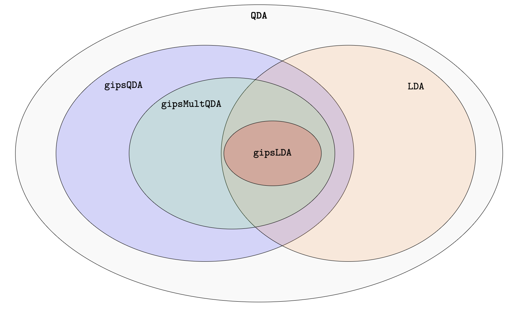

```{r, include = FALSE}
knitr::opts_chunk$set(
  collapse = TRUE,
  comment = "#>",
  fig.width = 7,
  fig.height = 5
)
```

## Overview

`gipsDA` extends classical Linear Discriminant Analysis (LDA) and
Quadratic Discriminant Analysis (QDA) by replacing standard empirical covariance
estimates with covariance estimates regularized by permutation-invariant
structures learned with the `gips` framework.

The package provides three model-fitting functions:

- `gipslda()` — LDA with a projected pooled covariance matrix.
- `gipsqda()` — QDA with independently projected class-specific covariance matrices.
- `gipsmultqda()` — QDA with class-specific covariance matrices and a jointly
  estimated permutation structure.

The functions follow the familiar conventions of `MASS::lda()` and
`MASS::qda()`: they support formula, matrix, and data-frame interfaces, and their
`predict()` methods return predicted classes and posterior probabilities.

## Installation

Install the released version from CRAN:

```{r, eval = FALSE}
install.packages("gipsDA")
```

Or install the development version from GitHub:

```{r, eval = FALSE}
pak::pkg_install("AntoniKingston/gipsDA")
```

Load the package:

```{r}
library(gipsDA)
```

## Quick start

We use the built-in `iris` data set and create a simple stratified train/test
split.

```{r}
set.seed(42)

train_id <- unlist(
  lapply(split(seq_len(nrow(iris)), iris$Species), sample, size = 35),
  use.names = FALSE
)

train <- iris[train_id, ]
test <- iris[-train_id, ]
```

Fit a `gipsqda()` model using the formula interface.

```{r}
fit <- gipsqda(Species ~ ., data = train)

fit
```

Predict classes for the test set.

```{r}
pred <- predict(fit, test)

head(pred$class)
head(pred$posterior)

mean(pred$class == test$Species)
```

## Preparing data

`gipsDA` works with numeric predictors and a categorical grouping variable.

Before fitting a model:

- remove or impute missing values,
- remove non-informative columns, such as identifiers,
- encode categorical predictors before passing them to the model,
- avoid mixing variables with incomparable scales when possible.

Because the method searches for symmetries between variables, predictors should
be meaningfully comparable. For example, variables measured in the same units or
representing analogous sensor readings are more natural candidates for
permutation symmetry.

Standardization can be useful when predictors are on very different scales, but
it should be done carefully. In particular, scaling parameters should be estimated
on the training data only and then applied to new data.


## Model relationships

The three `gipsDA` models are related to classical LDA and QDA as shown below.

```{r model-hierarchy, echo = FALSE, fig.cap = "The diagram illustrates the hierarchical relationships between the models.", out.width = "95%"}

```

The figure illustrates the inclusion relations between the model classes.
`gipsqda()` is contained in QDA, `gipslda()` is contained in LDA, and
`gipsmultqda()` lies between `gipsqda()` and `gipslda()`.


## Choosing a model

| Function | Covariance-matrix assumption | When this may be reasonable |
|---|---|---|
| `gipslda()` | all classes share one projected covariance matrix | classes differ mainly in their means, but have similar covariance structure |
| `gipsqda()` | each class has its own projected covariance matrix and its own permutation structure | classes may have different covariance patterns |
| `gipsmultqda()` | each class has its own covariance matrix, but all classes share one permutation structure | classes differ in scale or variance, but have a common dependency pattern between features |

## Key arguments

| Argument | Meaning |
|---|---|
| `prior` | prior probabilities of classes |
| `MAP` | whether to use the Maximum A Posteriori permutation or posterior-weighted averaging |
| `optimizer` | permutation-search strategy: `"BF"` or `"MH"` |
| `max_iter` | number of Metropolis-Hastings iterations when `optimizer = "MH"` |
| `weighted_avg` | covariance pooling strategy for `gipslda()` |
| `tol` | numerical tolerance used during fitting |

## MAP: Maximum A Posteriori

`MAP` stands for **Maximum A Posteriori**.

When `MAP = TRUE`, the model selects the single most probable permutation
structure and uses the covariance matrix projected onto that structure.

```{r}
lda_map <- gipslda(
  Species ~ .,
  data = train,
  MAP = TRUE
)

lda_map
```

When `MAP = FALSE`, the model uses posterior probabilities over retained
permutation structures and computes a posterior-weighted covariance estimate.

```{r}
lda_avg <- gipslda(
  Species ~ .,
  data = train,
  MAP = FALSE
)

lda_avg
```

In printed model output, a result such as `(1243)` is written in cycle notation.
It means that the permutation maps feature `1` to `2`, `2` to `4`, `4` to `3`,
and `3` back to `1`. Features appearing in the same cycle are treated as
exchangeable under the selected symmetry structure.

## Optimizer

The `optimizer` argument controls how permutation structures are searched.

| Value | Meaning | Recommended use |
|---|---|---|
| `"BF"` | brute-force search | small problems, typically `p <= 10` |
| `"MH"` | Metropolis-Hastings search | larger problems, typically `p > 10` |

For `optimizer = "MH"`, use `max_iter` to control the number of iterations.

```{r, eval = FALSE}
fit_mh <- gipsqda(
  Species ~ .,
  data = train,
  optimizer = "MH",
  max_iter = 1000
)
```

For `optimizer = "BF"`, `max_iter` is ignored.

## `weighted_avg` in `gipslda()`

`weighted_avg` controls how the pooled covariance matrix is constructed before
the `gips` projection is applied.

Let `K` be the number of classes, `n_k` the number of observations in class `k`,
`n` the total number of observations, and `S_k` the sample covariance matrix in
class `k`.

With `weighted_avg = FALSE`, `gipslda()` uses the classic pooled covariance
estimator:

\[
S_{\mathrm{classic}}
=
\frac{1}{n - K}
\sum_{k = 1}^{K}
(n_k - 1) S_k.
\]

With `weighted_avg = TRUE`, it uses the class-size-weighted average:

\[
S_{\mathrm{weighted}}
=
\frac{1}{n}
\sum_{k = 1}^{K}
n_k S_k.
\]

```{r}
lda_classic <- gipslda(
  Species ~ .,
  data = train,
  weighted_avg = FALSE
)

lda_weighted <- gipslda(
  Species ~ .,
  data = train,
  weighted_avg = TRUE
)

c(
  classic = mean(predict(lda_classic, test)$class == test$Species),
  weighted = mean(predict(lda_weighted, test)$class == test$Species)
)
```

## Fitting all three models

```{r}
lda_fit <- gipslda(Species ~ ., data = train)
qda_fit <- gipsqda(Species ~ ., data = train)
joint_qda_fit <- gipsmultqda(Species ~ ., data = train)
```

```{r}
lda_pred <- predict(lda_fit, test)
qda_pred <- predict(qda_fit, test)
joint_qda_pred <- predict(joint_qda_fit, test)

c(
  gipslda = mean(lda_pred$class == test$Species),
  gipsqda = mean(qda_pred$class == test$Species),
  gipsmultqda = mean(joint_qda_pred$class == test$Species)
)
```

## Inspecting fitted models

The most readable way to inspect a fitted model is to print it.

```{r}
print(lda_fit)
```

```{r}
print(qda_fit)
```

```{r}
print(joint_qda_fit)
```

The printed output shows the model call, class priors, group means, and
information about selected or averaged permutation structures.

For a structural summary of the object, use `summary()`.

```{r}
summary(lda_fit)
summary(qda_fit)
summary(joint_qda_fit)
```

Fitted models are list-like S3 objects, so their components can also be inspected
directly.

```{r}
names(lda_fit)
names(qda_fit)
names(joint_qda_fit)
```

The `optimization_info` component stores information returned by the permutation
optimization step.

```{r}
lda_fit$optimization_info
qda_fit$optimization_info
joint_qda_fit$optimization_info
```

## Prediction output

Prediction returns a list. The most important components are:

| Component | Meaning |
|---|---|
| `class` | predicted class labels |
| `posterior` | posterior class probabilities |
| `x` | discriminant coordinates, when available |

```{r}
names(lda_pred)

head(lda_pred$class)
head(lda_pred$posterior)
```


## Matrix interface

The formula interface is usually the most convenient, but the matrix interface is
also available.

```{r}
x <- as.matrix(iris[, 1:4])
grouping <- iris$Species

fit_matrix <- gipslda(x, grouping)

predict(fit_matrix, x[1:5, ])$class
```

The same style can be used with `gipsqda()` and `gipsmultqda()`.

```{r}
qda_matrix <- gipsqda(x, grouping)
joint_qda_matrix <- gipsmultqda(x, grouping)

predict(qda_matrix, x[1:5, ])$class
predict(joint_qda_matrix, x[1:5, ])$class
```


## Summary

For a first analysis, start with:

```{r}
fit <- gipslda(Species ~ ., data = train)
pred <- predict(fit, test)

mean(pred$class == test$Species)
```

Use:

| Function | Use when |
|---|---|
| `gipslda()` | classes can reasonably share one covariance structure |
| `gipsqda()` | each class may have its own covariance structure |
| `gipsmultqda()` | classes may have different covariance matrices but a shared dependency pattern |

The main tuning choices are:

| Argument | Practical meaning |
|---|---|
| `MAP = TRUE` | use one selected Maximum A Posteriori permutation |
| `MAP = FALSE` | average over retained permutations using posterior probabilities |
| `optimizer = "BF"` | exhaustive search, typically for `p <= 10` |
| `optimizer = "MH"` | stochastic search, typically for `p > 10` |
| `max_iter` | used only with `optimizer = "MH"` |
| `weighted_avg` | changes the pooled covariance estimator in `gipslda()` |
